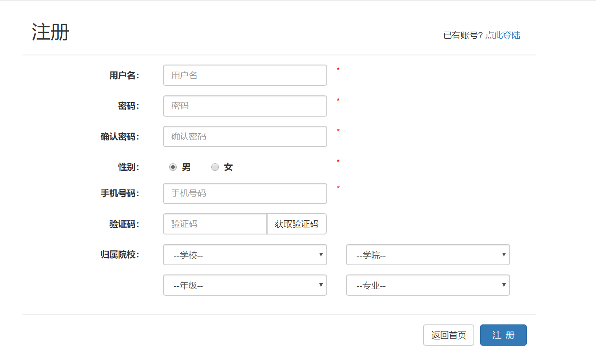
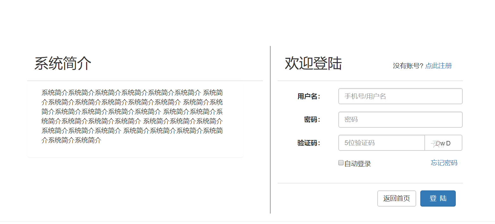
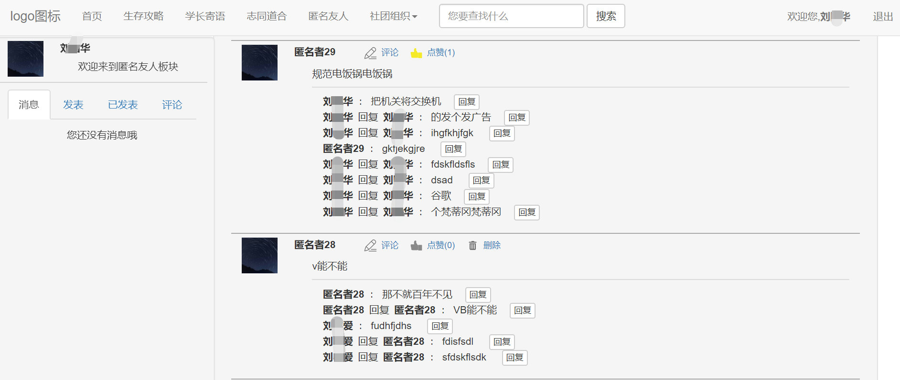
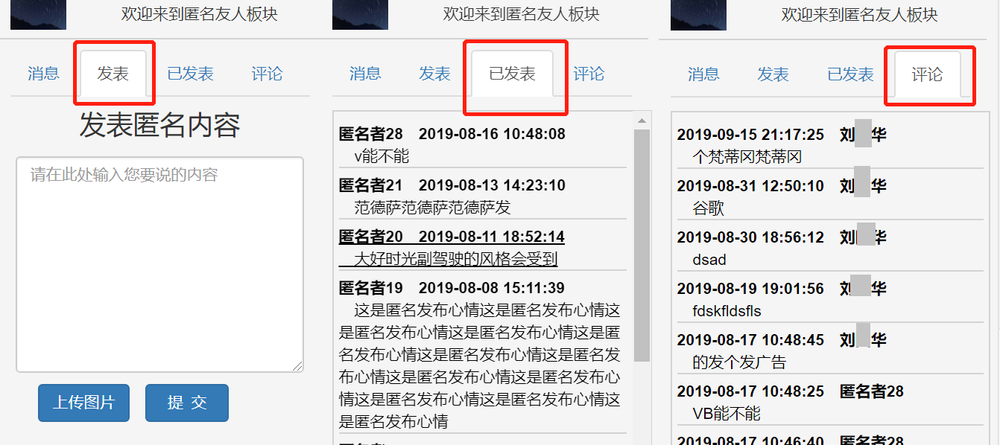
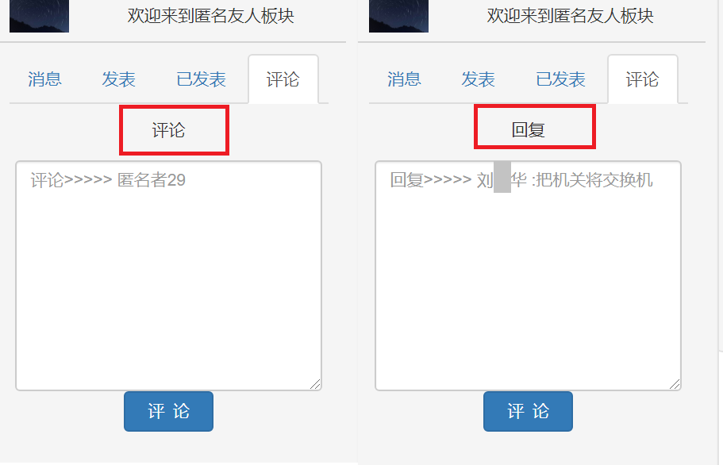

# ZJGuideWebsite
#### 该项目是基于 B/S 结构的一个校园论坛系统，目前实现的功能有注册、登陆以及匿名友人板块，匿名友人板块能够发表、查看、评论、点赞匿名说说。
## 功能截图  

#### 一、注册模块  
* 用户在首页页点击导航栏的“注册”或者在登录页面点击去“点此注册”后会跳转到该注册页面。该页面的获取验证码功能尚未实现，暂时还不能使用  
* 功能实现：  
    - 用户输入基本的信息后点击右下角的"注册"按钮，前端将用户输入的数据传递到后端程序中  
    - 接着后端程序判断该用户注册信息中的用户名和电话号码是已经存在  
    - 若存在，则提示用户换一个名字或者用手机号码直接登录  
    - 若不存在，先将用户的密码进行MD5加密，然后将用户填写的注册信息写进数据库中。  
* 下图是注册功能的页面
   

#### 二、登录模块
* 用户在首页点击导航条的"登录"或者在注册页面点击“点此登录”以及用户注册时手机号码已经存在时会跳转到该登录页面。
* 功能实现：  
    - 用户可以选择用用户名或者手机号码登录，用户输入信息后，点击“登陆”按钮，前端会将用户输入的账号、密码、验证码、是否勾选“自动登陆”等信息发送到后端程序中  
    - 后端程序接收到用户提交的信息后，首先会判断用户输入的验证码是否正确，错误则返回登陆页面。  
    - 验证码正确则将判断账号密码是否正确，错误则返回登陆页面。  
    - 账号密码正确后会将判断用户是否勾选了“自动登陆”
    - 若勾选了，则将该用户的用户ID保存在cookie中，cookie的有效期为3天，3天内用户会自动登陆。  
    - 用户登陆成功后，会将该用户的信息保存在session中，然后前端页面会跳转到首页。  
    - 用户忘记了密码，可以通过点击登录页面中“忘记密码”链接进行密码更换。
* 下图是登录功能的页面
  

#### 三、匿名友人板块  
* 用户点击导航栏中的“匿名友人”即可跳转到匿名友人板块。  
* 该匿名友人板块分为两种情况，一种是用户未登录显示，另外一种是用户已经登录显示。
* 用户未登陆的显示：  
    - 会将数据库中的匿名说说加载到前端页面中。  
    - 不会显示左侧的功能栏中的功能（消息、发表、已发表、评论）。  
    - 评论、点赞、回复等功能无法使用。
* 用户未登陆的显示：  
    - 用户登陆后，可以正常使用该板块的所有功能，该板块的功能有发表、评论、点赞、回复等功能。  
    - 用户登陆后，来到该板块，程序会将数据库中的匿名说说加载到前端页面中。  
    - 匿名说说中的点赞图标会根据用户是否有点赞该条说说而选择是否高亮。  
    - 用户自己发表的匿名说说会在点赞功能后面显示一个删除按钮。  
    - 用户在回复/评论自己发表的匿名说说，用户名会自动显示为匿名者n(n为数字)  
* 功能展示：  
    - 用户点击左侧功能栏中的“消息”项，会显示用户未查看的评论、回复，用户查看后，消息会被清除。  
    - 用户点击左侧功能栏中的“发表”项，用户可以在此处发表匿名说说，支持上传图片。  
    - 用户点击左侧功能栏中的“已发表”项，会显示该用户发表过的匿名说说，点击某条匿名说说会在右侧显示区中详细地显示这条匿名说说。  
    - 用户点击左侧功能栏中的“评论”项，会显示该用户的评论、回复。点击某条评论/回复会在右侧显示区中详细地显示评论/回复这条匿名说说。  
    - 用户点击匿名说说中的“评论”或者“回复”按钮时，左侧的功能栏的"评论"项中的内容会变为评论或者回复的输入面板，用户可以在这里输入要评论或者回复的内容。  
    - 用户点击匿名说说中的“点赞”按钮，能够点赞或者取消点赞。  
    - 用户点击匿名说说中的“删除”按钮，会将删除该条匿名说说。
* 下图是匿名友人板块的页面

* 下图是匿名友人板块左侧功能栏

* 下图是匿名友人板块评论、回复功能面板

